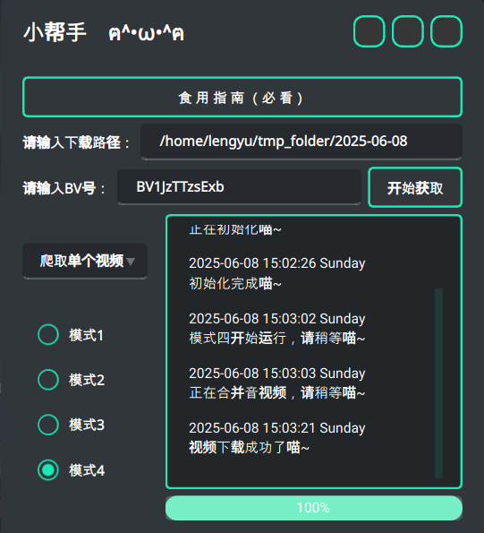

# Bilibili Video Get
一个小生在大一时基于 `Python` 实现的 B 站视频爬取项目，目前已基于 `Pyside6` 制作出用户界面，以提供便捷的图形界面操作。

---

## 1. 安装依赖包

该项目基于 `Python` 实现，食用前请先参照 `requirements.txt` 配置好 `Python` 环境：

```bash
pip install -r requirements.txt
```

## 2. 安装 ffmpeg
此外，由于 B 站视频在爬取的时候是**音频文件与画面文件分离**的，所以如果需要将音频文件与画面文件合并为一个完整的视频文件，代码里调用了 `ffmpeg`，需要用户自行安装并配置环境变量：

### Windows ⬇️

参考 ffmpeg 官网：https://ffmpeg.org/download.html

### Linux ⬇️
Linux 下，可以前往官网下载，也可以使用包管理器进行下载，这里简单列举 `Ubuntu` 和 `Archlinux` 的例子：

#### Ubuntu
```bash
sudo apt install ffmpeg
```

#### Archlinux
```bash
sudo pacman -S ffmpeg
```

或使用 `aur`：

```bash
paru -S ffmpeg
```

### MacOS
（暂未尝试过，可以自己折腾折腾）

## 3. 更改 Cookie
请在 `main.py` 文件中将 `headers` 中的 `Cookie` 的值设置为自己 B 站的 Cookie

（出于**隐私安全**考虑，小生没有把自己的 Cookie 放上去，所以该项目并非 100% 开袋即食💦）

> 什么？你**不知道怎么找 Cookie**？在 B 站首页进入开发者模式（通常按 `F12` 可快捷打开），然后进入 `Network` 选项卡，刷新 B 站界面，会发现选项卡的 `Name` 栏下有一个 `www.bilibili.com` 的 document，点开后可以在其 `Headers` 选项卡下找到 Cookies。

## 4. 运行程序
正常情况下，运行 `main.py` 便可以直接食用了

## 5. 📦 打包为 `.exe`（for Windows 🪟）
当然，如果你是 `Windows` 操作系统，且想要将该项目打包为 `.exe` 文件的话，**直接**用 `Pyinstaller` 打包的话，会出现 `ffmpeg` 相关的问题。

**解决方案**：可以下载一个 `ffmpeg.exe`，将其移动到项目文件下，`Pyinstaller` 打包的时候将 `ffmpeg.exe` 一起打包进去。（由于项目已经年代久远，具体操作可以参考网络平台，作者当年就是这么解决的）

## 6. 特别鸣谢
该项目是小生在**大一刚刚接触爬虫**的时候写的项目，在前端设计方面只考虑了 `Windows` 操作系统，而没有对 `Linux` 做适配，导致最初的版本在 `Linux` 上会出现奇怪的 bug，感谢 [@WiIIiamWei](https://github.com/WiIIiamWei) 让小生意识到这个问题 🎉